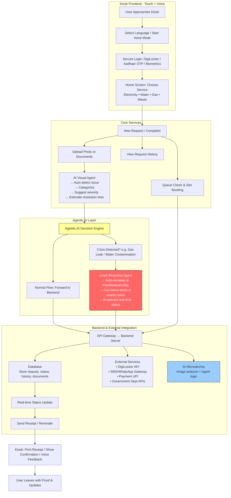

```mermaid
flowchart TD
    subgraph User Interaction [Kiosk Frontend - Touch + Voice]
        A[User Approaches Kiosk] --> B[Select Language / Start Voice Mode]
        B --> C[Secure Login: DigiLocker / Aadhaar OTP / Biometrics]
        C --> D[Home Screen: Choose Service<br/>Electricity • Water • Gas • Waste]
    end

    subgraph Core Services
        D --> E[New Request / Complaint]
        E --> F[Upload Photo or Documents]
        F --> G[AI Visual Agent<br/>→ Auto-detect issue<br/>→ Categorize<br/>→ Suggest severity<br/>→ Estimate resolution time]
        E --> H[Queue Check & Slot Booking]
        E --> I[View Request History]
    end

    subgraph Agentic AI Layer
        G --> J[Agentic AI Decision Engine]
        J --> K[Normal Flow: Forward to Backend]
        J --> L[Crisis Detected? e.g. Gas Leak / Water Contamination]
        L --> M[Crisis Response Agent<br/>→ Auto-escalate to Fire/Medical/Utility<br/>→ Geo-fence alerts to nearby users<br/>→ Broadcast real-time status]
    end

    subgraph Backend & External Integration
        K --> N[API Gateway → Backend Server]
        M --> N
        H --> N
        N --> O[Database<br/>Store request, status, history, documents]
        N --> P[External Services<br/>• DigiLocker API<br/>• SMS/WhatsApp Gateway<br/>• Payment UPI<br/>• Government Dept APIs]
        N --> Q[AI Microservice<br/>Image analysis + Agent logic]
        O --> R[Real-time Status Update]
        R --> S[Send Receipt / Reminder]
    end

    S --> T[Kiosk: Print Receipt / Show Confirmation / Voice Feedback]
    T --> U[User Leaves with Proof & Updates]

    style J fill:#ff9,stroke:#333
    style M fill:#f66,stroke:#333,color:white
    style Q fill:#9cf,stroke:#333

```
